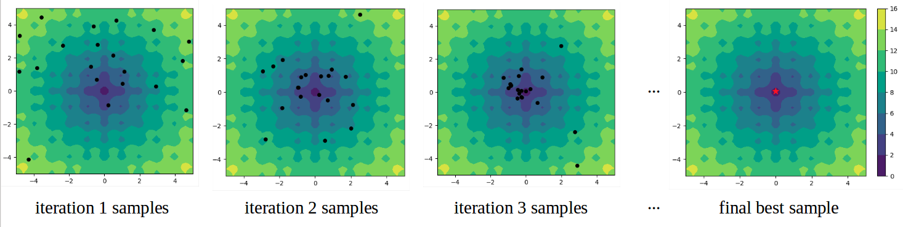

# Adaptive Sampling for Black-box Optimization 

Official Github repo for the three black-box optimization methods described in “[AdaNS: Adaptive Non-Uniform Sampling for Automated Design of Compact DNNs](https://ieeexplore.ieee.org/document/9086078)” published in the IEEE Journal of Special Topics in Signal Processing. The goal is to search for the global maxima or global minima of an expensive black-box function (e.g. optimal hyperparameters for simulation, neural network compression). Here is an example of searching for the minimizer of a 2-dimensional objective function:



The figures show the contours of the objective function and the black dots represent samples generated at each iteration. The final solution is shown with the red star.


We present three sampling strategies to perform the optimization. To use the library, the user selects the desired sampling strategy, provides an objective function, specifies the search domain (valid ranges of each hyperparameter), and sets the corresponding parameters for the optimization tool. The library then optimizes the provided objective function and returns the optimal set of hyperparameters.

## Performing Optimization:

We provide three examples for performing optimization with AdaNS in `main_Gaussian.py`, `main_Genetic.py`, and `main_Zoom.py`. Each of the files incorporates a different sampling strategy for optimization described in the paper. Below we summarize the common arguments needed for all files:

 -  The objective function needs to be wrapped into a Python function.
    
    ```python
    def evaluator_fn(x):
        ...
        return f
    
    ```
    
    where `x` is a vector of design hyperparameters to be optimized, and `f` is the value of the objective function evaluated at x. You can also choose from a set of example objective functions provided in `utils/example_functions.py`.

   - The rest of the arguments used by the three optimization tools are as follows: 

		```python
		#------------- Sampler parameters
		parser.add_argument('--name', default='test_fn_0', help='experiment name, used to specify the folder to save sampling results (default: test_fn_0)')
		parser.add_argument('--minimize', action='store_true', help='if selected,the function will be minimized, otherwise maximized')
		parser.add_argument('--test_fn', type=str, help='(optional) choose from common optimization test functions [rastrigin, ]')
		parser.add_argument('--plot_contour', action='store_true', help='if selected, the sampler will save contours of the objective function along with per-iteration samples')
		parser.add_argument('--seed', default=0, type=int, help='random seed (default: 0)')
		
		parser.add_argument('--num_samples', default=50, type=int, help='per-iteration sample size (default: 50)')
		parser.add_argument('--dim', type=int,help='dimensionality of the search-space (default: None)')
		parser.add_argument('--path_to_boundaries', default='', type=str,help='path to csv file containing search-space boundaries (default: '')')
		parser.add_argument('--n_iter', default=50, type=int, help='number of optimization iterations (default: 50)')
		parser.add_argument('--n_parallel', default=1, type=int, help='number of cores for parallel evaluations (default:1)')
		parser.add_argument('--alpha_max', default=1.0, type=float, help='alpha_max parameter (default:1.0)')
		parser.add_argument('--early_stopping', default=1000, type=int, help='number of iterations without improvement to activate early stopping (default: 1000)')
		```
	
   - Arguments specifically used by `main_Gaussian.py` are as follows: 
	
		```python
		#-------------- Gaussian Sampler parameters
		parser.add_argument('--u_random_portion', default=0.2, type=float,help='portion of samples to take unifromly random from the entire space (default:0.2)') 
		parser.add_argument('--local_portion', default=0.4, type=float, help='portion of samples to take from gaussians using the Local method (default:0.4)')
		parser.add_argument('--cross_portion', default=0.4, type=float, help='portion of samples to take from gaussians using the Cross method (default:0.4)')
		parser.add_argument('--pair_selection', default='top_and_random', type=str, help='how to select sample pairs for crossing, choose from [random,top_scores,top_and_nearest,top_and_furthest,top_and_random] (default:top_and_random)')
		```

   - Arguments specifically used by `main_Genetic.py` are as follows: 
	
		```python
		#-------------- Genetic Sampler parameters
		parser.add_argument('--p_cross', default=0.8, type=float, help='probability of crossover (default: 0.8)')
		parser.add_argument('--p_swap', default=0.2, type=float,help='per-bit exchange probability (default: 0.2)')
		parser.add_argument('--p_mutate', default=0.8, type=float, help='probability of mutate (default: 0.8)')
		parser.add_argument('--p_tweak', default=0.05, type=float, help='per-bit tweaking probability (default: 0.05)')
		parser.add_argument('--mutate_scale', default=0.2, type=float, help='std of the noise added during mutation (default: 0.2)')
		```
	
## Reference:
If you use this project please cite our work:

```
@article{javaheripi2020adans,
  title={AdaNS: Adaptive Non-Uniform Sampling for Automated Design of Compact DNNs},
  author={Javaheripi, Mojan and Samragh, Mohammad and Javidi, Tara and Koushanfar, Farinaz},
  journal={IEEE Journal of Selected Topics in Signal Processing},
  volume={14},
  number={4},
  pages={750--764},
  year={2020},
  publisher={IEEE}
}
```

